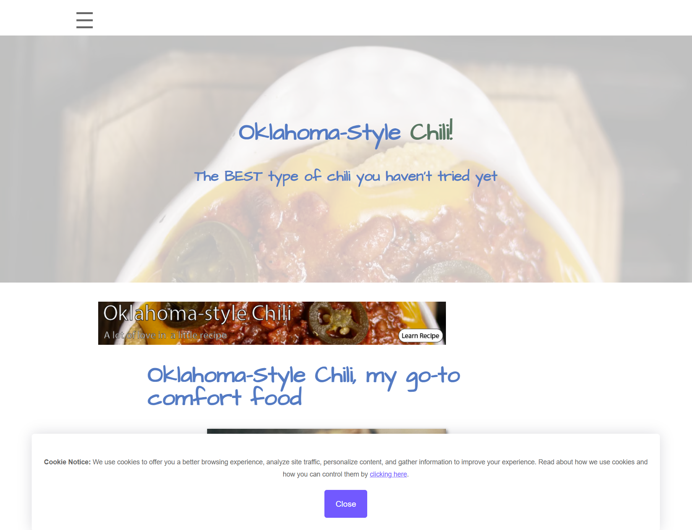
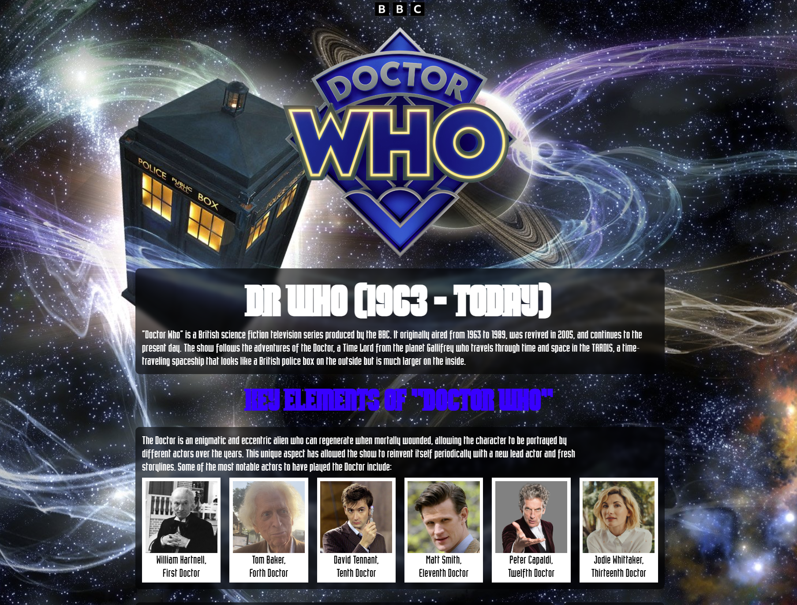
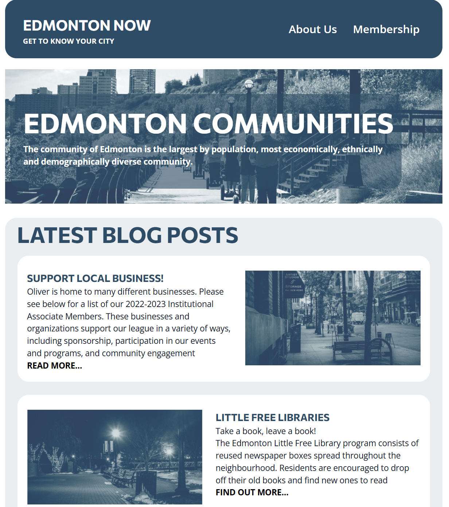

# Hey ya! Thanks for stopping by!

I’m Kevin, an aspiring web developer and designer working in their spare time. Having studied web design at NAIT for 2 years, I’ve learned a lot about how to code and design an appealing website. While I know school is just the start of my career, I intend to treat every website I make as a learning opportunity; a chance for me to learn new skills and hone my existing skills into a fine edge. Admittedly, I can’t say I’ve gotten here entirely on my own, as the bonds I formed with my classmates helped me learn not only more about coding and design, but about myself as a person and where I fit into this small slice of the wider world.

Anyways, enough of that boring philosophy crap. You came here to see a web designer, not a philosophy major. I know what you’re asking: “What kinds of skills do you have?” and “Why should I hire you over any other web developer?”. Well, I’m glad you asked. Here’s a short list of skills I’ve learned in my time as a developer.

## My Skill Set

### I can code in these languages:

    

### Frameworks I can use:

   

### Platforms I use regularly:

   

### Programs I have experience using

   

## My Contact Information

### Phone: 
+1 (780) - 691 - 1766

### Email: 
kevinmparadis@gmail.com

### Discord: 
Available upon request

## Projects I've Made ( My Portfolio )

### Top Asian Massage & Foot Reflexology
[Top Asian Massage & Foot Reflexology](https://topasianmassage.com)

This is my most recent and proudest work. This is my capstone project I have made along side a fellow classmate. While my classmate was in charge of creating the design and layout of the website, I was the lead developer and content creator. My tasks were to establish the functionality of a wordpress website to which a design could be added onto later, researching and writing all necessary content for the website, primarily by researching the massage techniques offered by our client, and writing a biography about the client from information provided to me. I discovered during this project I have a passion for writing, and found it very satisfying to actually get the content I wrote onto the website after the design was finalized. This was my first experience working directly with a client, and the experiences I had making this website have become an integral part of my future career.

### Oklahoma-Style Chili

While not the prettiest thing I've ever coding, design was not the purpose of this project. This project was intended to help familiarize myself with Search Engine Optimization (SEO) principles, maintaining beneficial links between other websites, and establishing my understanding of how the backend of every website should be established. I learned how to register a domain, getting my domain registered within google analytics, and making proper humans.txt, privacy.txt, robots.txt and sitemap files so the website can be deemed more trustworthy. With my efforts in SEO, I was able to get my website to the 4th result on google for "Alberta oklahoma style chili". As of now, the website is offline, as I have no further need to maintain it.

### Dr. Who Website

I was given content for a Dr. Who inspired fan website and was tasked with making a design for it. While I'm not always the most confident with my design skills, I was very pleased with how the website came to be. It was another hard coded HTML and CSS website, but the main purpose of this website was to flex my creative muscles and making a design that fit the source material. I showed this website to a friend of mine who is very familiar with Dr. Who, and they said the design was very fitting for the show.

### Edmonton Communities Project

This was a project I made during my first semester. It was my first real experience making a website completely from scratch using only a Figma document to design the website. Using my freshly learned skills in HTML and CSS, I was able to bring this all together. Looking back at it, it's a small and very basic website, but the skills I used making this would solidify the foundational knowledge I would need going forward with my schooling and career.
